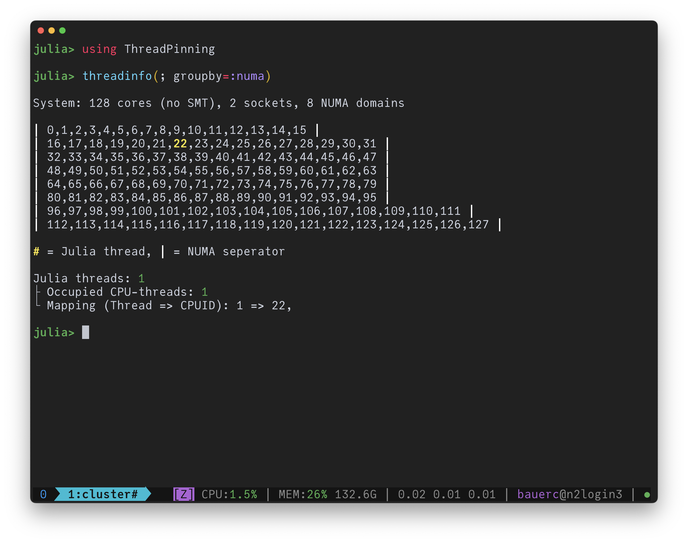

# Querying NUMA properties

Basic information can be readily queried:

```julia
julia> numa_available()
true

julia> nnumanodes()
8

julia> ncpus()
128

julia> current_cpu()
22

julia> current_numa_node() # NUMA node IDs start at zero! (so this result means the second node)
1

julia> numa_get_membind()
Bitmask (trunc): 11111111
```

To get a nice visualization of the system topology it is highly recommended to use [ThreadPinning.jl](https://github.com/carstenbauer/ThreadPinning.jl) and `threadinfo(; groupby=:numa)` specifically.

